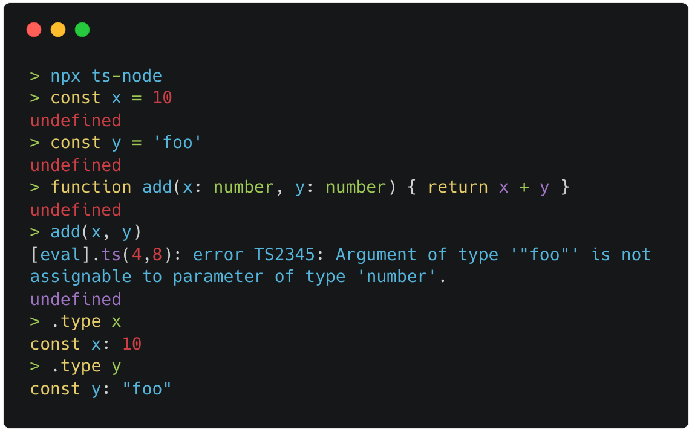

<!--
BEFORE EDITING THIS README
Our README.md is auto-generated by combining pages in website/docs and website/readme-sources

If you are sending a pull request to improve documentation, submit your changes
in the source markdown files and we will generate the README from there.

You can build the readme with this command:

    cd website && yarn build-readme
-->

# 

[](https://npmjs.org/package/ts-node)
[](https://npmjs.org/package/ts-node)
[](https://github.com/TypeStrong/ts-node/actions?query=workflow%3A%22Continuous+Integration%22)
[](https://codecov.io/gh/TypeStrong/ts-node)

> TypeScript execution and REPL for node.js, with source map support. **Works with `typescript@>=2.7`**.

The latest documentation can also be found on our website: <https://typestrong.org/ts-node>

*Experimental ESM support*

Native ESM support is currently experimental. For usage, limitations, and to provide feedback, see [#1007](https://github.com/TypeStrong/ts-node/issues/1007).

# Table of Contents

*   [Overview](#overview)
    *   [Features](#features)
*   [Installation](#installation)
*   [Usage](#usage)
    *   [Shell](#shell)
    *   [Shebang](#shebang)
    *   [Programmatic](#programmatic)
        *   [Developers](#developers)
*   [Configuration](#configuration)
    *   [CLI flags](#cli-flags)
    *   [Via tsconfig.json (recommended)](#via-tsconfigjson-recommended)
        *   [@tsconfig/bases](#tsconfigbases)
    *   [Options](#options)
    *   [`node` flags](#node-flags)
*   [CommonJS vs native ECMAScript modules](#commonjs-vs-native-ecmascript-modules)
    *   [CommonJS](#commonjs)
    *   [Native ECMAScript modules](#native-ecmascript-modules)
*   [Troubleshooting](#troubleshooting)
    *   [Understanding Errors](#understanding-errors)
        *   [`TSError`](#tserror)
        *   [`SyntaxError`](#syntaxerror)
            *   [Unsupported JavaScript syntax](#unsupported-javascript-syntax)
*   [Make it fast](#make-it-fast)
    *   [Skip typechecking](#skip-typechecking)
    *   [With typechecking](#with-typechecking)
*   [Advanced](#advanced)
    *   [How It Works](#how-it-works)
        *   [Skipping `node_modules`](#skipping-node_modules)
    *   [paths and baseUrl
        ](#paths-and-baseurl)
        *   [Why is this not built-in to `ts-node`?](#why-is-this-not-built-in-to-ts-node)
    *   [Help! My Types Are Missing!](#help-my-types-are-missing)
    *   [Third-party compilers](#third-party-compilers)
    *   [Third-party transpilers](#third-party-transpilers)
        *   [Bundled `swc` integration](#bundled-swc-integration)
        *   [Writing your own integration](#writing-your-own-integration)
*   [Recipes](#recipes)
    *   [Watching and Restarting](#watching-and-restarting)
    *   [AVA](#ava)
        *   [CommonJS](#commonjs-1)
        *   [Native ECMAScript modules](#native-ecmascript-modules-1)
    *   [Gulp](#gulp)
    *   [IntelliJ and Webstorm](#intellij-and-webstorm)
    *   [Mocha](#mocha)
        *   [Mocha 7 and newer](#mocha-7-and-newer)
        *   [Mocha <=6](#mocha-6)
    *   [Visual Studio Code](#visual-studio-code)
    *   [Other](#other)
*   [License](#license)

# Overview

`ts-node` is a TypeScript execution engine and REPL for Node.js.

It JIT transforms TypeScript into JavaScript, enabling you to directly execute TypeScript on Node.js without precompiling.
This is accomplished by hooking node's module loading APIs, enabling it to be used seamlessly alongside other Node.js
tools and libraries.

## Features

*   Automatic sourcemaps in stack traces
*   Automatic `tsconfig.json` parsing
*   Typechecking (optional)
*   REPL
*   Write standalone scripts
*   Native ESM loader
*   Use third-party transpilers
*   Use custom transformers
*   Integrate with test runners, debuggers, and CLI tools
*   Compatible with pre-compilation for production



# Installation

```shell
# Locally in your project.
npm install -D typescript
npm install -D ts-node

# Or globally with TypeScript.
npm install -g typescript
npm install -g ts-node

# Depending on configuration, you may also need these
npm install -D tslib @types/node
```

**Tip:** Installing modules locally allows you to control and share the versions through `package.json`. TS Node will always resolve the compiler from `cwd` before checking relative to its own installation.

# Usage

## Shell

```sh
# Execute a script as `node` + `tsc`.
ts-node script.ts

# Starts a TypeScript REPL.
ts-node

# Execute code with TypeScript.
ts-node -e 'console.log("Hello, world!")'

# Execute, and print, code with TypeScript.
ts-node -p -e '"Hello, world!"'

# Pipe scripts to execute with TypeScript.
echo 'console.log("Hello, world!")' | ts-node

# Equivalent to ts-node --transpile-only
ts-node-transpile-only script.ts

# Equivalent to ts-node --cwd-mode
ts-node-cwd script.ts
```

## Shebang

```typescript
#!/usr/bin/env ts-node

console.log("Hello, world!")
```

Passing CLI arguments via shebang is allowed on Mac but not Linux.  For example, the following will fail on Linux:

    #!/usr/bin/env ts-node --files
    // This shebang is not portable.  It only works on Mac

Instead, specify all `ts-node` options in your `tsconfig.json`.

## Programmatic

You can require `ts-node` and register the loader for future requires by using `require('ts-node').register({ /* options */ })`. You can also use file shortcuts - `node -r ts-node/register` or `node -r ts-node/register/transpile-only` - depending on your preferences.

**Note:** If you need to use advanced node.js CLI arguments (e.g. `--inspect`), use them with `node -r ts-node/register` instead of the `ts-node` CLI.

### Developers

`ts-node` exports a `create()` function that can be used to initialize a TypeScript compiler that isn't registered to `require.extensions`, and it uses the same code as `register`.

# Configuration

`ts-node` supports a variety of options which can be specified via `tsconfig.json`, as CLI flags, as environment variables, or programmatically.

## CLI flags

`ts-node` CLI flags must come *before* the entrypoint script. For example:

```shell
$ ts-node --project tsconfig-dev.json say-hello.ts Ronald
Hello, Ronald!
```

## Via tsconfig.json (recommended)

`ts-node` automatically finds and loads `tsconfig.json`.  Most `ts-node` options can be specified in a `"ts-node"` object using their programmatic, camelCase names. We recommend this because it works even when you cannot pass CLI flags, such as `node --require ts-node/register` and when using shebangs.

Use `--skip-project` to skip loading the `tsconfig.json`.  Use `--project` to explicitly specify the path to a `tsconfig.json`.

When searching, it is resolved using [the same search behavior as `tsc`](https://www.typescriptlang.org/docs/handbook/tsconfig-json.html). By default, this search is performed relative to the entrypoint script. In `--cwd-mode` or if no entrypoint is specified -- for example when using the REPL -- the search is performed relative to `--cwd` / `process.cwd()`.

You can use this sample configuration as a starting point:

```jsonc title="tsconfig.json"
{
  // This is an alias to @tsconfig/node10: https://github.com/tsconfig/bases
  "extends": "ts-node/node10/tsconfig.json",

  // Most ts-node options can be specified here using their programmatic names.
  "ts-node": {
    // It is faster to skip typechecking.
    // Remove if you want ts-node to do typechecking.
    "transpileOnly": true,

    "files": true,

    "compilerOptions": {
      // compilerOptions specified here will override those declared below,
      // but *only* in ts-node.  Useful if you want ts-node and tsc to use
      // different options with a single tsconfig.json.
    }
  }
}
```

Our bundled [JSON schema](https://unpkg.com/browse/ts-node@latest/tsconfig.schema.json) lists all compatible options.

### @tsconfig/bases

[tsconfig/bases](https://github.com/tsconfig/bases) maintains recommended configurations for several node versions.
As a convenience, these are bundled with `ts-node`.

```jsonc title="tsconfig.json"
{
  "extends": "ts-node/node16/tsconfig.json",

  // Or install directly with `npm i -D @tsconfig/node16`
  "extends": "@tsconfig/node16/tsconfig.json",
}
```

## Options

`ts-node` supports `--print` (`-p`), `--eval` (`-e`), `--require` (`-r`) and `--interactive` (`-i`) similar to the [node.js CLI options](https://nodejs.org/api/cli.html).

*API options with an \* cannot be specified via `tsconfig.json`*

| CLI | Environment Variable | API & tsconfig.json | Description |
|-----|----------------------|---------------------|-------------|
| `-h, --help` |  |  | Prints the help text |
| `-v, --version` |  |  | Prints the version. `-vv` prints node and typescript compiler versions, too. |
| `-c, --cwd-mode` |  |  | Resolve config relative to the current directory instead of the directory of the entrypoint script. |
| `--script-mode` |  |  | Resolve config relative to the directory of the entrypoint script. This is the default behavior. |
| `-T, --transpile-only` | `TS_NODE_TRANSPILE_ONLY` | `transpileOnly` | Use TypeScript's faster `transpileModule` (default: `false`) |
| `--type-check` | `TS_NODE_TYPE_CHECK` |  | Opposite of `--transpile-only`. (default: `true`) |
| `-H, --compiler-host` | `TS_NODE_COMPILER_HOST` | `compilerHost` | Use TypeScript's compiler host API (default: `false`) |
| `-I, --ignore [pattern]` | `TS_NODE_IGNORE` | `ignore` | Override the path patterns to skip compilation (default: `/node_modules/`) |
| `-P, --project [path]` | `TS_NODE_PROJECT` | `project` | Path to TypeScript JSON project file |
| `-C, --compiler [name]` | `TS_NODE_COMPILER` | `compiler` | Specify a custom TypeScript compiler (default: `typescript`) |
| `-D, --ignore-diagnostics [code]` | `TS_NODE_IGNORE_DIAGNOSTICS` | `ignoreDiagnostics` | Ignore TypeScript warnings by diagnostic code |
| `-O, --compiler-options [opts]` | `TS_NODE_COMPILER_OPTIONS` | `compilerOptions` | JSON object to merge with compiler options |
| `--cwd` | `TS_NODE_CWD` |  | Behave as if invoked in this working directory. (default: `process.cwd()`) |
| `--files` | `TS_NODE_FILES` | `files` | Load `files`, `include` and `exclude` from `tsconfig.json` on startup (default: `false`) |
| `--pretty` | `TS_NODE_PRETTY` | `pretty` | Use pretty diagnostic formatter (default: `false`) |
| `--skip-project` | `TS_NODE_SKIP_PROJECT` | `skipProject` | Skip project config resolution and loading (default: `false`) |
| `--skip-ignore` | `TS_NODE_SKIP_IGNORE` | `skipIgnore` | Skip ignore checks (default: `false`) |
| `--emit` | `TS_NODE_EMIT` | `emit` | Emit output files into `.ts-node` directory (default: `false`) |
| `--prefer-ts-exts` | `TS_NODE_PREFER_TS_EXTS` | `preferTsExts` | Re-order file extensions so that TypeScript imports are preferred (default: `false`) |
| `--log-error` | `TS_NODE_LOG_ERROR` | `logError` | Logs TypeScript errors to stderr instead of throwing exceptions (default: `false`) |
| `--show-config` |  |  | Print resolved `tsconfig.json`, including `ts-node` options, and exit. |
| `--transpiler [name]` |  | `transpiler` | Specify a third-party, non-typechecking transpiler |
|  | `TS_NODE_DEBUG` |  | Enable debug logging. |
|  | `TS_NODE_HISTORY` |  | Path to history file for REPL. (default; `~/.ts_node_repl_history`) |
| `--scope` | `TS_NODE_SCOPE` | `scope` | Scope compiler to files within `scopeDir`.  Files outside this directory will be ignored.  (default: `false`) |
|  |  | `scopeDir` | Sets directory for `scope`.  Defaults to tsconfig `rootDir`, directory containing `tsconfig.json`, or `cwd` |
|  |  | `projectSearchDir` | Search for config file in this or parent directories. |
|  |  | `transformers`\* | An object with transformers or a factory function that accepts a program and returns a transformers object to pass to TypeScript. Factory function cannot be used with `transpileOnly` flag |
|  |  | `readFile`\* | Custom TypeScript-compatible file reading function |
|  |  | `fileExists`\* | Custom TypeScript-compatible file existence function |

## `node` flags

[`node` flags](https://nodejs.org/api/cli.html) must be passed directly to `node`; they cannot be passed to the `ts-node` binary nor can they be specified in `tsconfig.json`

We recommend using the [`NODE_OPTIONS`](https://nodejs.org/api/cli.html#cli_node_options_options) environment variable to pass options to `node`.

```shell
NODE_OPTIONS='--trace-deprecation --abort-on-uncaught-exception' ts-node ./index.ts
```

Alternatively, you can invoke `node` directly and install `ts-node` via `--require`/`-r`

```shell
node --trace-deprecation --abort-on-uncaught-exception -r ts-node/register ./index.ts
```

# CommonJS vs native ECMAScript modules

TypeScript is almost always written using modern `import` syntax, but you can choose to either transform to CommonJS or use node's native ESM support.  Configuration is different for each.

Here is a brief comparison of the two.

| CommonJS | Native ECMAScript modules |
|---|---|
| Write native `import` syntax | Write native `import` syntax |
| Transforms `import` into `require()` | Does not transform `import` |
| Node executes scripts using the classic [CommonJS loader](https://nodejs.org/dist/latest-v16.x/docs/api/modules.html) | Node executes scripts using the new [ESM loader](https://nodejs.org/dist/latest-v16.x/docs/api/esm.html) |
| Use any of:<br/>`ts-node` CLI<br/>`node -r ts-node/register`<br/>`NODE_OPTIONS="ts-node/register" node`<br/>`require('ts-node').register({/* options */})` | Must use the ESM loader via:<br/>`node --loader ts-node/esm`<br/>`NODE_OPTIONS="--loader ts-node/esm" node` |

## CommonJS

Transforming to CommonJS is typically simpler and more widely supported.  You must remove or set [`"type": "commonjs"`](https://nodejs.org/api/packages.html#packages_type) in `package.json` and [`"module": "CommonJS"`](https://www.typescriptlang.org/tsconfig/#module) in `tsconfig.json`.

```jsonc title="package.json"
{
  // This can be omitted; commonjs is the default
  "type": "commonjs"
}
```

```jsonc title="tsconfig.json"
{
  "compilerOptions": {
    "module": "CommonJS"
  }
}
```

If you must keep `"module": "ESNext"` for `tsc`, webpack, or another build tool, you can set an override for `ts-node`.

```jsonc title="tsconfig.json"
{
  "compilerOptions": {
    "module": "ESNext"
  },
  "ts-node": {
    "compilerOptions": {
      "module": "CommonJS"
    }
  }
}
```

## Native ECMAScript modules

[Node's ESM loader hooks](https://nodejs.org/api/esm.html#esm_experimental_loaders) are [**experimental**](https://nodejs.org/api/documentation.html#documentation_stability_index) and subject to change. `ts-node`'s ESM support is also experimental. They may have
breaking changes in minor and patch releases and are not recommended for production.

For complete usage, limitations, and to provide feedback, see [#1007](https://github.com/TypeStrong/ts-node/issues/1007).

You must set [`"type": "module"`](https://nodejs.org/api/packages.html#packages_type) in `package.json` and [`"module": "ESNext"`](https://www.typescriptlang.org/tsconfig/#module) in `tsconfig.json`.

```jsonc title="package.json"
{
  "type": "module"
}
```

```jsonc title="tsconfig.json"
{
  "compilerOptions": {
    "module": "ESNext" // or ES2015, ES2020
  }
}
```

# Troubleshooting

## Understanding Errors

It is important to differentiate between errors from `ts-node`, errors from the TypeScript compiler, and errors from `node`.  It is also important to understand when errors are caused by a type error in your code, a bug in your code, or a flaw in your configuration.

### `TSError`

Type errors from the compiler are thrown as a `TSError`.  These are the same as errors you get from `tsc`.

### `SyntaxError`

Any error that is not a `TSError` is from node.js (e.g. `SyntaxError`), and cannot be fixed by TypeScript or `ts-node`. These are bugs in your code or configuration.

#### Unsupported JavaScript syntax

Your version of `node` may not support all JavaScript syntax supported by TypeScript.  The compiler must transform this syntax via "downleveling," which is controlled by
the [tsconfig `"target"` option](https://www.typescriptlang.org/tsconfig#target).  Otherwise your code will compile fine, but node will throw a `SyntaxError`.

For example, `node` 12 does not understand the `?.` optional chaining operator.  If you use `"target": "esnext"`, then the following TypeScript syntax:

```typescript
const bar: string | undefined = foo?.bar;
```

will compile into this JavaScript:

```javascript
const a = foo?.bar;
```

When you try to run this code, node 12 will throw a `SyntaxError`.  To fix this, you must switch to `"target": "es2019"` or lower so TypeScript transforms `?.` into something `node` can understand.

# Make it fast

These tricks will make `ts-node` faster.

## Skip typechecking

It is often better to use `tsc --noEmit` to typecheck once before your tests run or as a lint step. In these cases, `ts-node` can skip typechecking.

*   Enable [`transpileOnly`](#options) to skip typechecking
*   Use our [`swc` integration](#bundled-swc-integration)
    *   This is by far the fastest option

## With typechecking

*   Avoid dynamic `require()` which may trigger repeated typechecking; prefer `import`
*   Try with and without `--files`; one may be faster depending on your project
*   Check `tsc --showConfig`; make sure all executed files are included
*   Enable [`skipLibCheck`](https://www.typescriptlang.org/tsconfig#skipLibCheck)
*   Set a [`types`](https://www.typescriptlang.org/tsconfig#types) array to avoid loading unnecessary `@types`

# Advanced

## How It Works

`ts-node` works by registering hooks for `.ts`, `.tsx`, `.js`, and/or `.jsx` extensions.

Vanilla `node` loads `.js` by reading code from disk and executing it.  Our hook runs in the middle, transforming code from TypeScript to JavaScript and passing the result to `node` for execution.  This transformation will respect your `tsconfig.json` as if you had compiled via `tsc`.

`.js` and `.jsx` are only transformed when [`allowJs`](https://www.typescriptlang.org/docs/handbook/compiler-options.html#compiler-options) is enabled.

`.tsx` and `.jsx` are only transformed when [`jsx`](https://www.typescriptlang.org/docs/handbook/jsx.html) is enabled.

> **Warning:** if a file is ignored or its file extension is not registered, node will either fail to resolve the file or will attempt to execute it as JavaScript without any transformation.  This may cause syntax errors or other failures, because node does not understand TypeScript type syntax nor bleeding-edge ECMAScript features.

> **Warning:** When `ts-node` is used with `allowJs`, all non-ignored JavaScript files are transformed using the TypeScript compiler.

### Skipping `node_modules`

By default, **TypeScript Node** avoids compiling files in `/node_modules/` for three reasons:

1.  Modules should always be published in a format node.js can consume
2.  Transpiling the entire dependency tree will make your project slower
3.  Differing behaviours between TypeScript and node.js (e.g. ES2015 modules) can result in a project that works until you decide to support a feature natively from node.js

## paths and baseUrl&#xA;

You can use `ts-node` together with [tsconfig-paths](https://www.npmjs.com/package/tsconfig-paths) to load modules according to the `paths` section in `tsconfig.json`.

```jsonc title="tsconfig.json"
{
  "ts-node": {
    // Do not forget to `npm i -D tsconfig-paths`
    "require": ["tsconfig-paths/register"]
  }
}
```

### Why is this not built-in to `ts-node`?

The official TypeScript Handbook explains the intended purpose for `"paths"` in ["Additional module resolution flags"](https://www.typescriptlang.org/docs/handbook/module-resolution.html#additional-module-resolution-flags).

> The TypeScript compiler has a set of additional flags to *inform* the compiler of transformations that are expected to happen to the sources to generate the final output.
>
> It is important to note that the compiler will not perform any of these transformations; it just uses these pieces of information to guide the process of resolving a module import to its definition file.

This means `"paths"` are intended to describe mappings that the build tool or runtime *already* performs, not to tell the build tool or
runtime how to resolve modules.  In other words, they intend us to write our imports in a way `node` already understands.  For this reason, `ts-node` does not modify `node`'s module resolution behavior to implement `"paths"` mappings.

## Help! My Types Are Missing!

**TypeScript Node** does *not* use `files`, `include` or `exclude`, by default. This is because a large majority projects do not use all of the files in a project directory (e.g. `Gulpfile.ts`, runtime vs tests) and parsing every file for types slows startup time. Instead, `ts-node` starts with the script file (e.g. `ts-node index.ts`) and TypeScript resolves dependencies based on imports and references.

For global definitions, you can use the `typeRoots` compiler option.  This requires that your type definitions be structured as type packages (not loose TypeScript definition files). More details on how this works can be found in the [TypeScript Handbook](https://www.typescriptlang.org/docs/handbook/tsconfig-json.html#types-typeroots-and-types).

Example `tsconfig.json`:

```jsonc
{
  "compilerOptions": {
    "typeRoots" : ["./node_modules/@types", "./typings"]
  }
}
```

Example project structure:

```text
<project_root>/
-- tsconfig.json
-- typings/
  -- <module_name>/
    -- index.d.ts
```

Example module declaration file:

```typescript
declare module '<module_name>' {
    // module definitions go here
}
```

For module definitions, you can use [`paths`](https://www.typescriptlang.org/docs/handbook/module-resolution.html#path-mapping):

```jsonc
{
  "compilerOptions": {
    "baseUrl": ".",
    "paths": {
      "custom-module-type": ["types/custom-module-type"]
    }
  }
}
```

An alternative approach for definitions of third-party libraries are [triple-slash directives](https://www.typescriptlang.org/docs/handbook/triple-slash-directives.html). This may be helpful if you prefer not to change your TypeScript `compilerOptions` or structure your custom type definitions when using `typeRoots`. Below is an example of the triple-slash directive as a relative path within your project:

```typescript
/// <reference types="./types/untyped_js_lib" />
import UntypedJsLib from "untyped_js_lib"
```

**Tip:** If you *must* use `files`, `include`, or `exclude`, enable `--files` flags or set `TS_NODE_FILES=true`.

## Third-party compilers

Some projects require a patched typescript compiler which adds additional features.  For example, [`ttypescript`](https://github.com/cevek/ttypescript/tree/master/packages/ttypescript) and [`ts-patch`](https://github.com/nonara/ts-patch#readme)
add the ability to configure custom transformers.  These are drop-in replacements for the vanilla `typescript` module and
implement the same API.

For example, to use `ts-patch` and `ts-transformer-keys`, add this to your `tsconfig.json`:

```jsonc title="tsconfig.json"
{
  "ts-node": {
    "compiler": "ts-patch"
  },
  "compilerOptions": {
    "plugins": [
      { "transform": "ts-transformer-keys/transformer" }
    ]
  }
}
```

## Third-party transpilers

In transpile-only mode, we skip typechecking to speed up execution time.  You can go a step further and use a
third-party transpiler to transform TypeScript into JavaScript even faster.  You will still benefit from
`ts-node`'s automatic `tsconfig.json` discovery, sourcemap support, and global `ts-node` CLI.  Integrations
can automatically derive an appropriate configuration from your existing `tsconfig.json` which simplifies project
boilerplate.

> **What is the difference between a compiler and a transpiler?**
>
> For our purposes, a compiler implements TypeScript's API and can perform typechecking.
> A third-party transpiler does not.  Both transform TypeScript into JavaScript.

### Bundled `swc` integration

We have bundled an experimental `swc` integration.

[`swc`](https://swc.rs) is a TypeScript-compatible transpiler implemented in Rust.  This makes it an order of magnitude faster
than `transpileModule`.

To use it, first install `@swc/core` or `@swc/wasm`.  If using `importHelpers`, also install `@swc/helpers`.

```shell
npm i -D @swc/core @swc/helpers
```

Then add the following to your `tsconfig.json`.

```jsonc title="tsconfig.json"
{
  "ts-node": {
    "transpileOnly": true,
    "transpiler": "ts-node/transpilers/swc-experimental"
  }
}
```

> `swc` uses `@swc/helpers` instead of `tslib`.  If you have enabled `importHelpers`, you must also install `@swc/helpers`.

### Writing your own integration

To write your own transpiler integration, check our [API docs](https://typestrong.org/ts-node/api/interfaces/transpilermodule.html).

Integrations are `require()`d, so they can be published to npm.  The module must export a `create` function matching the
[`TranspilerModule`](https://typestrong.org/ts-node/api/interfaces/transpilermodule.html) interface.

# Recipes

## Watching and Restarting

**TypeScript Node** compiles source code via `require()`, watching files and code reloads are out of scope for the project. If you want to restart the `ts-node` process on file change, existing node.js tools such as [nodemon](https://github.com/remy/nodemon), [onchange](https://github.com/Qard/onchange) and [node-dev](https://github.com/fgnass/node-dev) work.

There's also [`ts-node-dev`](https://github.com/whitecolor/ts-node-dev), a modified version of [`node-dev`](https://github.com/fgnass/node-dev) using `ts-node` for compilation that will restart the process on file change.

## AVA

Assuming you are configuring AVA via your `package.json`, add one of the following configurations.

### CommonJS

Use this configuration if your `package.json` does not have `"type": "module"`.

```jsonc title"package.json"
{
  "ava": {
    "extensions": [
      "ts"
    ],
    "require": [
      "ts-node/register"
    ]
  }
}
```

### Native ECMAScript modules

This configuration is necessary if your `package.json` has `"type": "module"`.

```jsonc title"package.json"
{
  "ava": {
    "extensions": {
      "ts": "module"
    },
    "nonSemVerExperiments": {
      "configurableModuleFormat": true
    },
    "nodeArguments": [
      "--loader=ts-node/esm"
    ]
  }
}
```

## Gulp

ts-node support is built-in to gulp.

```sh
# Create a `gulpfile.ts` and run `gulp`.
gulp
```

See also: https://gulpjs.com/docs/en/getting-started/javascript-and-gulpfiles#transpilation

## IntelliJ and Webstorm

Create a new Node.js configuration and add `-r ts-node/register` to "Node parameters."

**Note:** If you are using the `--project <tsconfig.json>` command line argument as per the [Configuration Options](#configuration), and want to apply this same behavior when launching in IntelliJ, specify under "Environment Variables": `TS_NODE_PROJECT=<tsconfig.json>`.

## Mocha

### Mocha 7 and newer

```sh
mocha --require ts-node/register --extensions ts,tsx --watch --watch-files src 'tests/**/*.{ts,tsx}' [...args]
```

Or specify options via your mocha config file.

```jsonc title=".mocharc.json"
{
  // Specify "require" for CommonJS
  "require": "ts-node/register",
  // Specify "loader" for native ESM
  "loader": "ts-node/esm",
  "extensions": ["ts", "tsx"],
  "spec": [
    "tests/**/*.spec.*"
  ],
  "watch-files": [
    "src"
  ]
}
```

See also: https://mochajs.org/#configuring-mocha-nodejs

### Mocha <=6

```sh
mocha --require ts-node/register --watch-extensions ts,tsx "test/**/*.{ts,tsx}" [...args]
```

**Note:** `--watch-extensions` is only used in `--watch` mode.

## Visual Studio Code

Create a new node.js configuration, add `-r ts-node/register` to node args and move the `program` to the `args` list (so VS Code doesn't look for `outFiles`).

```jsonc
{
    "type": "node",
    "request": "launch",
    "name": "Launch Program",
    "runtimeArgs": [
        "-r",
        "ts-node/register"
    ],
    "args": [
        "${workspaceFolder}/index.ts"
    ]
}
```

**Note:** If you are using the `--project <tsconfig.json>` command line argument as per the [Configuration Options](#configuration), and want to apply this same behavior when launching in VS Code, add an "env" key into the launch configuration: `"env": { "TS_NODE_PROJECT": "<tsconfig.json>" }`.

## Other

In many cases, setting [`NODE_OPTIONS`](https://nodejs.org/api/cli.html#cli_node_options_options) will enable `ts-node` within other node tools, child processes, and worker threads.

```shell
NODE_OPTIONS="-r ts-node/register"
```

Or, if you require native ESM support:

```shell
NODE_OPTIONS="--loader ts-node/esm"
```

This tells any node processes which receive this environment variable to install `ts-node`'s hooks before executing other code.

# License

[MIT](https://github.com/TypeStrong/ts-node/blob/main/LICENSE)

ts-node includes source code from Node.js which is licensed under the MIT license.  [Node.js license information](https://raw.githubusercontent.com/nodejs/node/master/LICENSE)

ts-node includes source code from the TypeScript compiler which is licensed under the Apache License 2.0.  [TypeScript license information](https://github.com/microsoft/TypeScript/blob/master/LICENSE.txt)
